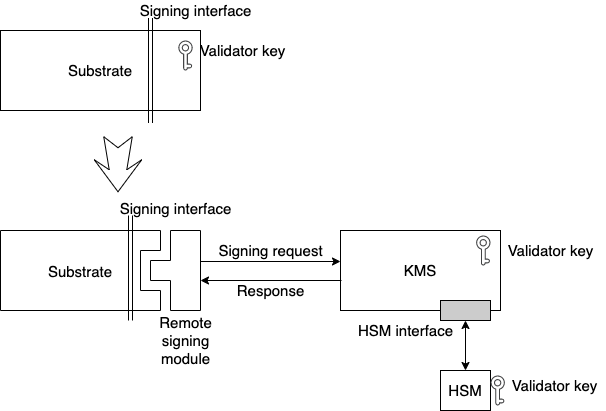

# Key Management Server for Polkadot Substrate

## Project Description
Key management is by far the most important feature regarding secure
communication and transactions. While the Polkadot substrate layer may hold the
validator keys in its internal memory or the local disk storage, there is
always a risk that the internal plain memory is accidentally compromised or
local disk is stolen physically. For this matter, it is a better choice to
introduce a signing entity or a signing server separated from the rest of the
operative jobs such as handling transactions or managing blocks and the chain.

A Key Management Server(KMS) would perform the following jobs:
- managing private signing keys securely
- signing requested messages(varying) on demand

Private keys should never leave the boundary of a key management server, or the
boundary of an HSM when an HSM is coupled with the server. A key management
server has its own separate admistrator interface to manage hosted keys. This
server hides the tidy details of managing keys from the Substrate and exposes
signing request APIs only to the Polkadot Substrate.

In this project, we have three stages to complete the job to introduce a KMS to
Polkadot Substrate:
1. design and implement a remote signing S/W module inside the Polkadot
   Substrate
1. design and implement a KMS to manage keys and respond to the signing
   requests
1. design and implement an optional interface between KMS and HSM (KMS would
   work with or without HSM)

## Team members
TBA
* Name of team leader
* Names of team members	

## Team Website	
* https://www.pentasecurity.com (English)
* https://www.pentasecurity.co.kr (Korean)

## Legal Structure 
Penta Security Systems Inc. 
Eusu Holdings Building, 20F 
25 Gukjegeumyung-ro 2-gil 
Yeongdeungpo-gu, Seoul, South Korea 07327 

Tel (+82) 2-780-7728 
Fax (+82) 2-786-5281 

## Team's experience
Founded on its data encryption technology in 1997, Penta Security Systems is a
leading provider of web and data security products, solutions and services:
- WAPPLES: Web Application Firewall
- D'Amo, D'Amo KMS, D'Amo PKI: Data Encryption and Key Management Solutions
- 

You can find the company history at
[website](https://www.pentasecurity.com/company/about-us/penta-security-history/).

One of the team members is also a major contributor of AMO blockchain project.
You can find the code repositories at [github](https://github.com/amolabs).

## Team Code Repos
* https://github.com/pentasecurity
* https://github.com/pentasecurity/polkadot-kms (not yet)

## Team LinkedIn Profiles
TBA
* https://www.linkedin.com/<person_1>
* https://www.linkedin.com/<person_2>

## Development Roadmap
### Milestones and schedule
1. **first design round** (1-2 weeks)
    1. design overall architecture
    1. design communication protocol spec between Polkadot Substrate and KMS
    1. fix the key type and digital signature algorithm
1. implement dummy client and server (2 weeks)
    1. implement core of signing function
    1. implement dummy signing server before full-pledged KMS 
       (accept signing request and respond the signature generated with the
       pre-loaded key)
    1. implement dummy client to test the dummy server
1. introduce remote signing support module on Substrate (2 weeks)
    1. split signing code within Substrate code base
    1. replace core signing code with the remote signing module
    1. test the basic functionality with the dummy server
    1. test the signing protocol soundness
1. Minestone #1 ends (1.5 months from the beginning)
1. **second design round** (1-2 weeks)
    1. design internal key management framework
        1. general housekeeping
        1. secure key generation
        1. secure key destroying
    1. design authentication mechanism between Polkadot and KMS
    1. adjust communication protocol
    1. design code structure for signing material preparation (e.g. block hash)
1. remote signing within Substrate (1 months)
    1. plug the remote signing module into Substrate code base
        1. modify signing material preparation ocde
    1. maintain a separate branch
    1. test with the dummy server
    1. test with a working Substrate with a testnet
1. minimal KMS (2 months)
    1. implement key management features
        1. general housekeeping
        1. secure key generation
        1. secure key destroying
1. authentication (1 month)
    1. implement authentication feature both on signing client(Substrate) and
       server(KMS)
    1. test accordingly
1. Minestone #2 ends (6 months from the beginning)
1. **third design round** (1-2 weeks)
    1. select several HSM devie types
    1. design HSM interface
        1. univeral HSM API layer
        1. individual HSM API driver for each HSM type
    1. (if necessary) adjust key management feature
1. HSM (2 months)
    1. implement HSM interface
    1. command channel: key management(generation and destroying) in HSM
1. Minestone #3 ends (8.5 months from the beginning)

The project is supposed to end in 8.5 ~ 9 months.

### License
Would be Apache 2.0.

### Future plan
Our long-term plan is to integrate PALLET X (cold wallet developed by Penta
Security) and Polkadot. This project is the first attempt to lay a bridge
between the two. We are planning to launch 2 more projects afterwards:
- PALLET X cold wallet integration
    - use PALLET X as a key management and signing server
        - may use Polkadot KMS(implemented in this project) and treat PALLET X
          as one of various HSMs
        - or implement Polkadot KMS protocol directly in PALLET X
        - this is subject to change
- Polkadot support in PALLET X
    - support Polkadot transactions directly in PALLET X

## Additional Information
We have good knowledge about blockchain technology, and developed our own cold
wallet for various of cryptocurrencies. One notable previous product is a
PALLET series.

One thing to note is that we borrow the basic idea from Tendermint KMS.
